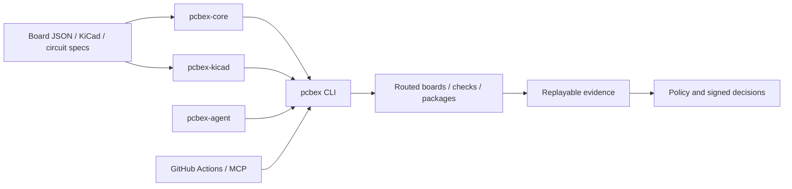

# Architecture

`pcbex` separates deterministic computation, external-tool adapters, retained
evidence, and authorization. That separation keeps routing logic testable and
prevents a successful subprocess or signature check from silently gaining more
authority than its contract allows.

## System map



The arrows show data and invocation flow, not automatic authority. Each
evidence or decision artifact has a focused contract that defines what it may
claim.

## Package ownership

| Component | Owns | Does not own |
| --- | --- | --- |
| `pcbex-core` | Board model, integer geometry, checking, placement, routing, migration, and quality metrics | KiCad syntax, network I/O, subprocesses, signatures, or release policy |
| `pcbex-kicad` | KiCad parsing/writing, schematic IR, electrical checks, board binding, native-report normalization | General CLI publication, provider orchestration, or supplier access |
| `pcbex` | CLI parsing, bounded Rust I/O, policies, evidence rendering, manufacturing, cryptography, pinned local-ledger commits, and child-process adapters | Natural-language provider loops or Python-owned multi-stage composition |
| `pcbex-agent` | Bounded Python orchestration, correction loops, replay composition, supplier correlation, public procurement authorization, and fresh reservation orchestration | Rust routing rules, cryptographic primitives, filesystem durability, or OS sandboxing |
| Composite Actions | CI setup, artifact retention, SARIF, summaries, and final job gates | New verification semantics beyond the invoked pcbex contracts |
| MCP server | Versioned stdio discovery and bounded tool execution | Network transport, extra authorization, or hidden command semantics |

## Design principles

### Deterministic core

Board coordinates and dimensions use integer nanometres. Routing and checking
avoid floating-point geometry decisions, while explicit work budgets bound A*,
zone fill, topology, and raster expansion.

Determinism covers equivalent validated inputs and the documented engine
version. It does not make an external executable, filesystem, provider, or
network response trustworthy.

### Closed contracts

Public artifacts carry a schema version and reject unknown fields. Schema
commands expose the current machine-readable shape, while `capabilities`
provides a versioned command inventory.

Examples illustrate a contract; they do not define it. Consumers should
validate against the emitted schema and enforce the focused document's semantic
rules.

### Evidence before authority

The design pipeline first records source identity, replay results, and bounded
findings. A later policy or signature boundary may consume that evidence, but
it cannot rewrite what the earlier artifact proved.

This pattern appears in AI review, fabrication authorization, supplier-offer
coverage, and procurement authorization. Negative policy outcomes are often
retained, while malformed or cross-bound input fails without a public report.

### Bounded adapters

External tools run without a shell and under explicit input, output, process,
and time limits. File readers reject unsafe types and unstable identities;
publishers use staged atomic or no-clobber commits according to each contract.

These controls reduce accidental ambiguity and resource abuse. They are not an
operating-system sandbox or a defense against every same-principal concurrent
writer.

## Data layers

| Layer | Representative artifacts | Primary owner |
| --- | --- | --- |
| Design intent | Circuit spec, schematic IR, board JSON | Core and KiCad crates |
| Physical result | Routed JSON, routed KiCad PCB, placement result | Core, KiCad, CLI |
| Verification | ERC/DRC, quality, board binding, final BOM/CPL | KiCad and CLI |
| Reproducible output | Firmware bundle, manufacturing ZIP, pipeline report | CLI |
| External observation | Provider receipt, factory receipt, supplier-offer receipt | CLI or agent adapters |
| Composition | Handoff replay, routing/manufacturing binding, assembly evidence, supplier coverage | Python agent |
| Authorization | Signed review, fabrication release, procurement release | Rust cryptography plus owning orchestrator |
| Local admission | Fabrication and procurement challenge reservation markers | Owning verifier plus Rust pinned-ledger boundary |
| Factory-release adapter | Durable signed-release intent, one POST attempt, GET reconciliation, and closed receipts | Rust pinned-ledger and bounded HTTP boundary |
| Authenticated factory response | Policy-pinned RFC 9421 signature, RFC 9530 body digest, covered request context, and durable positive or negative outer report | Rust cryptographic verifier layered over the unchanged factory-release adapter |
| Monotonic factory state | Completely reverified sequence/predecessor chain, immutable observations, and sequence-keyed state entries | Rust transition verifier plus the selected pinned Unix ledger |
| Factory-state transparency | Exact current state inclusion in one separately policy-pinned Ed25519-signed Merkle view | Rust receipt verifier layered over the unchanged v1.484 chain |
| Transparency consistency | Strict append-only extension between two fully reverified signed views plus a bounded no-replace predecessor chain | Rust consistency verifier layered over v1.485 reports and the selected pinned ledger |
| Transparency witness quorum | Exact latest v1.486 report and signed tree-head agreement across distinct externally policy-pinned organization, witness, and key tuples | Rust Ed25519 quorum verifier layered over the fully replayed consistency chain and selected pinned ledger |
| Transparency external anchor | Exact latest v1.487 report inclusion in one separately policy-pinned external Ed25519-signed Merkle view | Rust inclusion verifier layered over the fully replayed witness chain and selected pinned ledger |

Later layers should retain or bind earlier identities instead of copying a
boolean result. Fresh replay is required wherever the focused contract says a
retained snapshot alone is insufficient.

## Routing flow

The router validates the board, reserves imported copper, inflates obstacles by
clearance, and searches the declared copper stack. It then simplifies and
checks the complete result before publication.

Failed nets may trigger deterministic shove or rip-up work within fixed budgets.
Imported locked routes remain protected unless the selected repair contract
explicitly authorizes replacement.

For detailed limits, read [A* Work Budget](ASTAR_WORK_BUDGET.md),
[Zone-fill Work Budget](ZONE_FILL_WORK_BUDGET.md), and
[Numeric and Raster Limits](NUMERIC_RASTER_LIMITS.md).

## KiCad boundary

`pcbex-kicad` translates KiCad S-expressions into typed internal structures and
writes deterministic boards and schematics. The parser applies byte, token,
atom, depth, list, and span ceilings before downstream geometry consumes data.

Native `kicad-cli` runs remain external child processes. Normalized native
ERC/DRC reports prove what the selected executable returned for staged inputs;
they do not authenticate the executable itself.

## Python orchestration boundary

The agent freezes and bounds public inputs, invokes caller-selected commands
without a shell, validates returned artifacts, and publishes only after final
rereads. Rust remains the authority for board rules, policy semantics, and
cryptographic assessment.

Provider, replay, KiCad, and trusted cryptographic children have distinct roles.
Read [Python Agent Limits](PYTHON_AGENT_LIMITS.md) before supplying custom
commands or secrets.

## CI and release boundary

Composite Actions build and invoke the CLI, retain evidence, and apply final job
gates. Repository policy pins third-party action dependencies to reviewed commit
SHAs and bounds workflow execution.

Release automation verifies the version, roadmap, tests, checksums, SBOMs,
asset set, and protected-branch status before publication. See
[GitHub Actions Supply Chain](GITHUB_ACTIONS_SUPPLY_CHAIN.md),
[CI Execution Limits](CI_EXECUTION_LIMITS.md), and
[Completion Audit](COMPLETION_AUDIT.md).

## Routing convergence ownership

Routing convergence stays inside `pcbex-core`: it allocates one bounded A* work
portfolio, generates deterministic strategy candidates, runs the authoritative
checker, and accepts only strict validity-first improvements. The same crate
freshly reproduces retained schema-v1 decisions while preserving their producer
version. The CLI owns raw-source capture, exact KiCad/JSON regeneration,
cross-role alias rejection, and no-clobber verification evidence.

Neither layer turns either convergence artifact into native KiCad DRC,
manufacturing, or release authority. The producer report binds the effective
and selected internal Board models. The outer verifier additionally binds raw
source identities and exact routed bytes, but still does not authenticate those
sources or their policy origins.

The Python v1.476 composer keeps that Rust authority intact. It freshly invokes
the v1.475 KiCad verifier, then passes the same captured routed-board bytes and
sidecars into the existing manufacturing replay. Only an exact regenerated ZIP
produces `verified_ready`; incomplete routing skips fabrication and remains a
retained negative. See
[Fresh Routing-to-Manufacturing Handoff](ROUTING_MANUFACTURING_HANDOFF.md).

The Python v1.477 composer adds no new routing or DRC algorithm. It first
reproduces the complete v1.476 report, then invokes the existing Rust native
DRC verifier against the same staged routed board, project, and custom rules.
Only an exact clean normalized report yields `native_kicad_drc_verified`; all
manufacturability and authorization claims remain false. See
[Fresh Routing, Native DRC, and Manufacturing Handoff](ROUTING_DRC_MANUFACTURING_HANDOFF.md).

The Python v1.478 composer keeps both authorities separate. It reproduces the
complete v1.477 bytes, requires the pipeline-selected package to equal the
routing package, then invokes the explicit trusted Rust fabrication verifier
over the captured plan, receipt, policy, and approvals. Python cross-checks the
canonical policy pin and exact submitted approval envelopes before it can set
the conjunctive outer release decision. See
[Policy-pinned Routing, DRC, and Fabrication Release](ROUTING_DRC_FABRICATION_RELEASE.md).

The Python v1.479 consumer leaves both v1.478 authorities unchanged. After the
complete evidence closure is captured, it resolves three single-token native
entrypoints, matches their stable bytes to protected external digests, and
supplies those absolute commands to a fresh v1.478 reassessment of the retained
report's stable evidence/approval subject. The path-free outer result proves
byte-pin agreement at observation points, not historical-decision reuse, binary
origin, dependency/plugin provenance, OS state, isolation, or an external
factory effect. See
[Executable-pinned Fabrication Release](EXECUTABLE_PINNED_FABRICATION_RELEASE.md).

The Python v1.480 consumer adds a dedicated receipt-signature trust boundary.
Rust binds the exact normalized receipt, package, policy, signer, and window;
Python replays the stable v1.479 subject around that verifier and keeps every
real-world side-effect claim false. See
[Signed Factory-receipt Release](SIGNED_FACTORY_RECEIPT_RELEASE.md).

The v1.481 admission boundary adds the first stateful consumer in this chain.
Python freshly requires the same authenticated subject; Rust pins one trusted
Unix ledger and durably installs the signed challenge without replacement.
The compact marker is local replay protection, not factory capacity or an
order. See [Signed Release Reservation](SIGNED_FACTORY_RECEIPT_RELEASE_RESERVATION.md).

## Public discovery

Prefer runtime discovery over copied command lists:

```sh
pcbex capabilities
pcbex --help
pcbex <command> --help
pcbex-agent --help
```

The [Documentation Index](README.md) maps every major artifact to its exact
contract.
