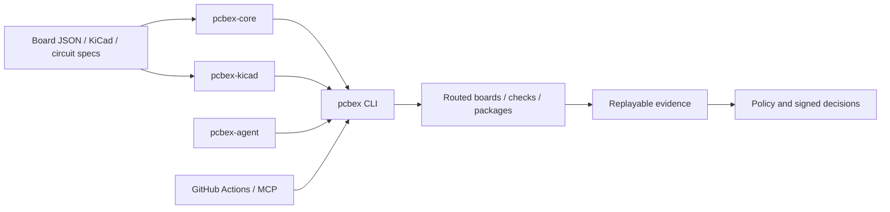

# Architecture

`pcbex` separates deterministic computation, external-tool adapters, retained
evidence, and authorization. That separation keeps routing logic testable and
prevents a successful subprocess or signature check from silently gaining more
authority than its contract allows.

## System map



The arrows show data and invocation flow, not automatic authority. Each
evidence or decision artifact has a focused contract that defines what it may
claim.

## Package ownership

| Component | Owns | Does not own |
| --- | --- | --- |
| `pcbex-core` | Board model, integer geometry, checking, placement, routing, migration, and quality metrics | KiCad syntax, network I/O, subprocesses, signatures, or release policy |
| `pcbex-kicad` | KiCad parsing/writing, schematic IR, electrical checks, board binding, native-report normalization | General CLI publication, provider orchestration, or supplier access |
| `pcbex` | CLI parsing, bounded Rust I/O, policies, evidence rendering, manufacturing, cryptography, pinned local-ledger commits, and child-process adapters | Natural-language provider loops or Python-owned multi-stage composition |
| `pcbex-agent` | Bounded Python orchestration, correction loops, replay composition, supplier correlation, public procurement authorization, and fresh reservation orchestration | Rust routing rules, cryptographic primitives, filesystem durability, or OS sandboxing |
| Composite Actions | CI setup, artifact retention, SARIF, summaries, and final job gates | New verification semantics beyond the invoked pcbex contracts |
| MCP server | Versioned stdio discovery and bounded tool execution | Network transport, extra authorization, or hidden command semantics |

## Design principles

### Deterministic core

Board coordinates and dimensions use integer nanometres. Routing and checking
avoid floating-point geometry decisions, while explicit work budgets bound A*,
zone fill, topology, and raster expansion.

Determinism covers equivalent validated inputs and the documented engine
version. It does not make an external executable, filesystem, provider, or
network response trustworthy.

### Closed contracts

Public artifacts carry a schema version and reject unknown fields. Schema
commands expose the current machine-readable shape, while `capabilities`
provides a versioned command inventory.

Examples illustrate a contract; they do not define it. Consumers should
validate against the emitted schema and enforce the focused document's semantic
rules.

### Evidence before authority

The design pipeline first records source identity, replay results, and bounded
findings. A later policy or signature boundary may consume that evidence, but
it cannot rewrite what the earlier artifact proved.

This pattern appears in AI review, fabrication authorization, supplier-offer
coverage, and procurement authorization. Negative policy outcomes are often
retained, while malformed or cross-bound input fails without a public report.

### Bounded adapters

External tools run without a shell and under explicit input, output, process,
and time limits. File readers reject unsafe types and unstable identities;
publishers use staged atomic or no-clobber commits according to each contract.

These controls reduce accidental ambiguity and resource abuse. They are not an
operating-system sandbox or a defense against every same-principal concurrent
writer.

## Data layers

| Layer | Representative artifacts | Primary owner |
| --- | --- | --- |
| Design intent | Circuit spec, schematic IR, board JSON | Core and KiCad crates |
| Physical result | Routed JSON, routed KiCad PCB, placement result | Core, KiCad, CLI |
| Verification | ERC/DRC, quality, board binding, final BOM/CPL | KiCad and CLI |
| Reproducible output | Firmware bundle, manufacturing ZIP, pipeline report | CLI |
| External observation | Provider receipt, factory receipt, supplier-offer receipt | CLI or agent adapters |
| Composition | Handoff replay, assembly evidence, supplier coverage | Python agent |
| Authorization | Signed review, fabrication release, procurement release | Rust cryptography plus owning orchestrator |
| Local admission | Fabrication and procurement challenge reservation markers | Owning verifier plus Rust pinned-ledger boundary |

Later layers should retain or bind earlier identities instead of copying a
boolean result. Fresh replay is required wherever the focused contract says a
retained snapshot alone is insufficient.

## Routing flow

The router validates the board, reserves imported copper, inflates obstacles by
clearance, and searches the declared copper stack. It then simplifies and
checks the complete result before publication.

Failed nets may trigger deterministic shove or rip-up work within fixed budgets.
Imported locked routes remain protected unless the selected repair contract
explicitly authorizes replacement.

For detailed limits, read [A* Work Budget](ASTAR_WORK_BUDGET.md),
[Zone-fill Work Budget](ZONE_FILL_WORK_BUDGET.md), and
[Numeric and Raster Limits](NUMERIC_RASTER_LIMITS.md).

## KiCad boundary

`pcbex-kicad` translates KiCad S-expressions into typed internal structures and
writes deterministic boards and schematics. The parser applies byte, token,
atom, depth, list, and span ceilings before downstream geometry consumes data.

Native `kicad-cli` runs remain external child processes. Normalized native
ERC/DRC reports prove what the selected executable returned for staged inputs;
they do not authenticate the executable itself.

## Python orchestration boundary

The agent freezes and bounds public inputs, invokes caller-selected commands
without a shell, validates returned artifacts, and publishes only after final
rereads. Rust remains the authority for board rules, policy semantics, and
cryptographic assessment.

Provider, replay, KiCad, and trusted cryptographic children have distinct roles.
Read [Python Agent Limits](PYTHON_AGENT_LIMITS.md) before supplying custom
commands or secrets.

## CI and release boundary

Composite Actions build and invoke the CLI, retain evidence, and apply final job
gates. Repository policy pins third-party action dependencies to reviewed commit
SHAs and bounds workflow execution.

Release automation verifies the version, roadmap, tests, checksums, SBOMs,
asset set, and protected-branch status before publication. See
[GitHub Actions Supply Chain](GITHUB_ACTIONS_SUPPLY_CHAIN.md),
[CI Execution Limits](CI_EXECUTION_LIMITS.md), and
[Completion Audit](COMPLETION_AUDIT.md).

## Routing convergence ownership

Routing convergence stays inside `pcbex-core`: it allocates one bounded A* work
portfolio, generates deterministic strategy candidates, runs the authoritative
checker, and accepts only strict validity-first improvements. The CLI owns the
explicit no-clobber report publication and KiCad/JSON serialization.

Neither layer turns a convergence record into native KiCad DRC, manufacturing,
or release authority. The path-free report binds the effective and selected
internal Board models, not the authenticity of raw input files or policy
origins.

## Public discovery

Prefer runtime discovery over copied command lists:

```sh
pcbex capabilities
pcbex --help
pcbex <command> --help
pcbex-agent --help
```

The [Documentation Index](README.md) maps every major artifact to its exact
contract.
